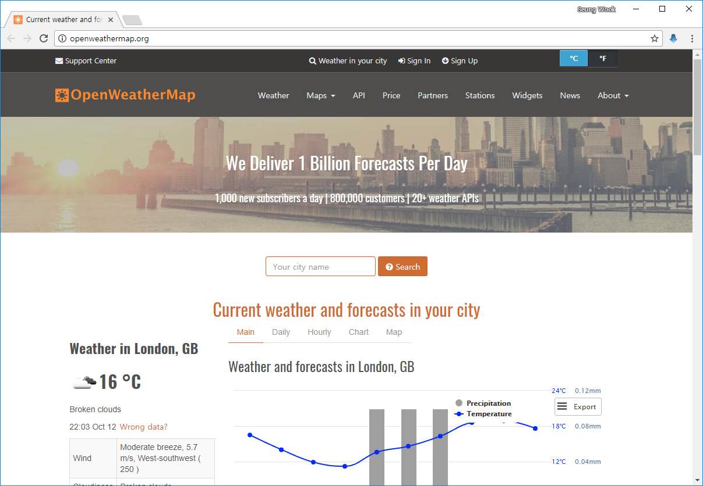

# 2-3 웹 API로 데이터 추출하기

### 웹 API(Application Programming Interface)

  - Web API: 어떤 사이트가 가지고 있는 기능을 외부에서도 쉽게 사용할 수 있게 공개한 것
  - API: 서로 다른 프로그램이 기능을 공유할 수 있게 절차와 규약을 정의한 것

웹 API는 일반적으로 HTTP통신을 사용하는데 클라이언트 프로그램은 API를 제공하는 서버에 HTTP요청을 보냅니다. 그러면 서버가 이러한 요청을 기반으로 XML또는 JSON형식 등으로 응답합니다.


</img>

### 웹 API를 제공하는 이유
 - 크롤링으로 인해 야기되는 서버 부하 감소
 - 상품을 알리거나 구매할 기회를 더 많이 주는 경우(옥션, 지마켓, 11번가 등)

### 웹 API의 단점
 - 웹 API가 없어지거나 사양변경이 일어날 수 있음
 - 웹 API가 없어질 경우를 대비하는 노력이 필요

### 웹 API 사용해보기 - OpenWeatherMap의 날씨 정보

(http://openweathermap.org)



OpenWeatherMap을 사용하려면 개발자 등록 후 API키를 발급받아야 함<br>
위 사이트 API는 기본적으로 유료이지만 5일 까지 날씨는 무료로 사용할 수 있습니다. <br>
 ※ 단, 1분에 60번만 호출 가능

<hr>
#### API key 발급 절차
&nbsp; 1) 회원가입<br>
&nbsp; 2) API 사용 용도 기입<br>
&nbsp; 3) 발급된 API 확인<br>
<hr>


<hr>


```python
import requests
import json

apikey = "ce10846e4dcc1c87d6545641b30a36b6"
cities = ["Seoul,KR", "Tokyo,JP", "New York,US"]

api = "http://api.openweathermap.org/data/2.5/weather?q={city}&APPID={key}"

k2c = lambda k: k - 273.15

for name in cities:
    url = api.format(city = name, key = apikey)
    
r = requests.get(url)
data = json.loads(r.text)

print("+ 도시 = ", data["name"])
print("| 날씨 = ", data["weather"][0]["description"])
print("| 최저 기온 = ", k2c(data["main"]["temp_min"]))
print("| 최고 기온 = ", k2c(data["main"]["temp_max"]))
print("| 습도 = ", data["main"]["humidity"])
print("| 기압 = ", data["main"]["pressure"])
print("| 풍향 = ", data["wind"]["deg"])
print("| 풍속 = ", data["wind"]["speed"])
print("")
```

    + 도시 =  New York
    | 날씨 =  moderate rain
    | 최저 기온 =  12.0
    | 최고 기온 =  15.0
    | 습도 =  82
    | 기압 =  1027
    | 풍향 =  70
    | 풍속 =  2.1
    
    


```python
print(url)
```

    http://api.openweathermap.org/data/2.5/weather?q=New York,US&APPID=ce10846e4dcc1c87d6545641b30a36b6
    


```python
print(r.text)
```

    {"coord":{"lon":-74.01,"lat":40.71},"weather":[{"id":501,"main":"Rain","description":"moderate rain","icon":"10d"},{"id":301,"main":"Drizzle","description":"drizzle","icon":"09d"}],"base":"stations","main":{"temp":286.73,"pressure":1027,"humidity":82,"temp_min":285.15,"temp_max":288.15},"visibility":16093,"wind":{"speed":2.1,"deg":70},"clouds":{"all":90},"dt":1507815300,"sys":{"type":1,"id":1969,"message":0.0116,"country":"US","sunrise":1507806290,"sunset":1507846745},"id":5128581,"name":"New York","cod":200}
    

(이쁘게 프린트가 안됩니다...)

이 외에도 다양한 사기업 및 공공기관의 API가 있습니다.

 - 네이버: https://developers.naver.com/products/intro/plan
 - 다음: https://developers.kakao.com/features/platform
 - 다나와: https://api.danawa.com/main/index.html
 - 옥션: http://developer.auction.co.kr
 - 행정자치부: http://www.juso.go.kr/addrlink/devAddrLinkRequestUse.do?menu=main
 - 우체국: http://biz.epost.go.kr/customCenter/custom/custom_9.jsp?subGubun=sub_3&subGubun_1=cum_17&gubun=m07


```python

```
