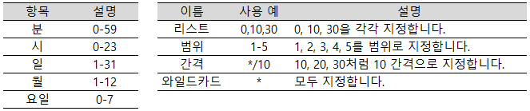

# cron을 이용한 정기적인 크롤링
<br>
 - 주기적으로 변경되는 데이터를 사용할 때는 정기적으로 데이터를 크롤링 해야 합니다.
 - macOS와 Linux에서는 "cron"이라는 데몬 프로세스를 사용해 정기적으로 데이터를 크롤링할 수 있습니다.
 - 윈도우에는 "작업스케쥴러(Task Scheduler)"라는 기능이 있습니다.
 
### 정기 실행의 장점

일반적으로 cron으로 다음과 같은 작업을 수행합니다.

 1. 데이터 수집과 같은 애플리케이션에서 필요한 정기적인 처리
 2. 로그, 백업과 같은 시스템에서 필요한 정기적인 처리
 3. 시스템이 제대로 동작하고 있는지 정기적으로 감시하는 처리
 
여기서는 1번을 다룹니다.

<hr>

### 매일 환률 정보 저장하기

네이버 금융의 환률 정보를 추출하는 프로그램을 만들어 봅시다.


```python
# !pip install bs4
from bs4 import BeautifulSoup
import urllib.request as req
import datetime

url = "http://info.finance.naver.com/marketindex/"
res = req.urlopen(url)

soup = BeautifulSoup(res, "html.parser")
# print(soup)
price = soup.select_one("div.head_info > span.value").string
print("usd/krw", price)

t = datetime.date.today()
fname = t.strftime("%Y-%m-%d") + ".txt"
with open(fname, "w", encoding = "UTF-8") as f:
    f.write(price)
```

    usd/krw 1,132.70
    

<hr>

### cron으로 매일 한 번 실행하기

UNIX 계열의 OS라면 대부분 cron이 기본적으로 설치돼 있습니다. <br>
cron을 사용하려면 설정 파일에 특정한 형식으로 실행 간격을 지정하면 됩니다.

#### "nano"에디터 설치하기

cron을 설정하려면 터미널에서 crontab이라는 명령어를 실행해 파일을 열고 편집해야 합니다. 기본적으로는 "vi"에디터가 실행됩니다. <br>
vi 조작이 익숙하지 않은 독자라면 "nano"를 설치해서 사용하기 바랍니다. <br>
가상환경을 포함해 Ununtu를 사용하고 있다면 다음과 같은 명령어를 실행해주세요.

> <b>$ sudo apt-get install nano</b>

터미널로 홈 폴더에 있는 ".bash_profile"이라는 설정 파일을 nano로 편집하는 명령어는 아래와 같습니다.

> <b>$nano ~/.bash_profile</b>

nano가 실행되면 파일 뒤에 다음과 같은 한 줄을 추가합니다.

> <b>export EDITOR=nano</b>

#### crontab으로 cron 설정하기

crontab을 실행할 때 "-e" 옵션을 추가해서 실행합니다. 이렇게 하면 cron설정 화면이 열립니다. <br>
처음 "crontab"을 실행했다면 아무것도 작성되지 않은 설정 파일이 열립니다.

> <b>crontab -e</b>

매일 아침 7시에 "evertday-dollar.py"를 실행하는 프로그램을 실행한다면 다음과 같이 입력합니다.

> <b>0 7 * * * python3 /home/test/everyday-dollar.py</b>

다만 crontab에 지정하는 환경변수는 우변을 따로 전개하지 않으므로 주의하기 바랍니다.

> #잘못된 지정 방식 <br>
> PATH=/usr/local/bin:$PATH

> #정상적인 지정 방식 <br>
> PATH=/usr/local/bin:/usr/bin:/bin


### crontab 설정 방법

> [서식] crontab <br>
> (분) (시) (일) (월) (요일) <실행할 명령어의 경로>



구체적인 설정 예시

 - macOS에서 매 분마다 "Hi"라고 이야기하는 프로그램
> <b>* * * * * /usr/bin/say "Hi</b>

 - 매일 아침 8시 30분에 "Good morning"이라고 인사하는 예
> <b>30 8 * * * /usr/bin/say "Good morning"</b>

 - 매월 30일 18시 32분에 /home/hoge/fuga.sh 라는 프로그램을 실행하는 예
> <b>32 18 20 * * /home/hoge/fuga.sh</b>

 - 매년 5월 6일 7시 8분에 "Have a nice day"라고 인사하는 예
> <b>08 07 06 05 * /usr/bin/say "Have a nice day"</b>

 - 다음은 매주 월요일 아침 7시 50분에 "쓰레기 버리는 날입니다!" 라고 알려주는 설정 예
> <b>50 07 * * 1 /usr/bin/say "쓰레기 버리는 날입니다!"</b>

cron으로 요일을 지정할 떄는 다음과 같은 숫자를 지정합니다.

월요일 = 1 <br>
화요일 = 2 <br>
수요일 = 3 <br>
목요일 = 4 <br>
금요일 = 5 <br>
토요일 = 6 <br>
일요일 = 7 또는 0

매월 마지막 날에 뭔가를 하고싶은 경우에는 기본적인 crontab으로는 지정할 수 없습니다. <br>
하지만 test 명령어와 조합해서 사용하면 매월 마지막 날을 검출할 수 있습니다.

> <b>50 23 28-31 ** /usr/bin/test $(date -d '+1 day' + %d) -eq 1 && <실행할 명령어></b>

또한 cron은 표준 출력 또는 오류 출력이 있으면 메일을 줍니다. 이러한 기능을 비활성화하고 싶을 때는 crontab의 앞에 MAILTO를 비워둡니다.

> <b>MAILTO=""</b>


```python

```
